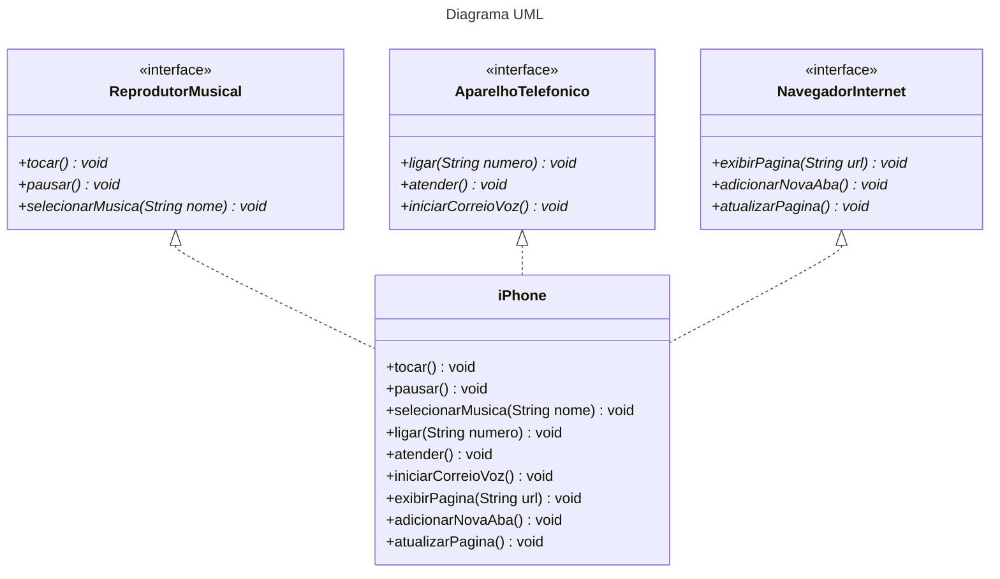

## [POO - Desafio](https://github.com/digitalinnovationone/trilha-java-basico/tree/main/desafios/poo)

### Diagrama UML utilizando [Mermaid](https://mermaid.js.org/):

Referências:
- [ibm.com](https://www.ibm.com/docs/pt-br/rsas/7.5.0?topic=relationships-implements) 

   Relacionamentos de implementos em diagrama de classes UML (Desenvolvendo visualmente relacionamentos entre elementos Java usando diagramas de classes UML)
- [Mermaid](https://mermaid.js.org/) 

    Class diagrams -> Defining Relationship -> Realization